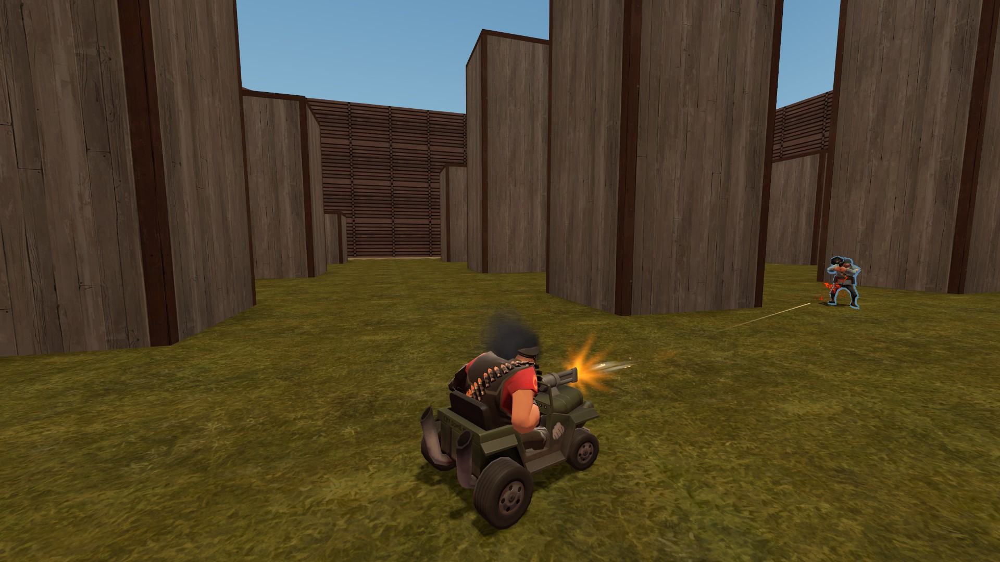
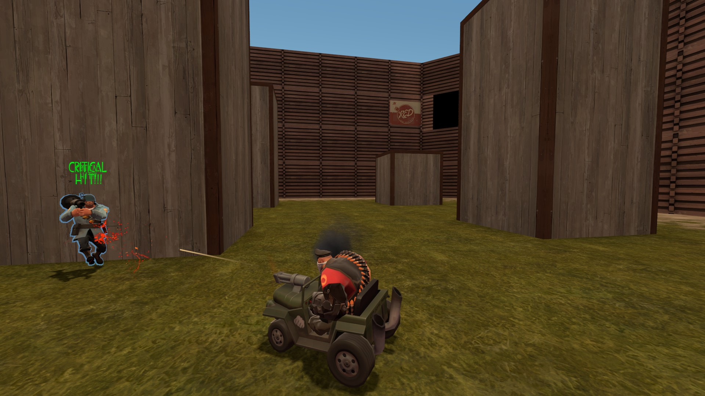

# TF2 Road Rager Taunt Bullets 

**Cykarblast** is a server-side SourceMod plugin for Team Fortress 2 that allows a Heavy taunting with the [Road Rager](https://wiki.teamfortress.com/wiki/Road_Rager) to blast bullets out of the car's turret.

Damage, bullet spread, and crit chances are configurable.  Friendly fire via `mp_friendlyfire` is also supported.

## Screenshots
<p align="center">
   &nbsp; 
</p>

https://github.com/geominorai/cykarblast/assets/13911156/94d16d91-8dcb-4943-8f07-7fbb64d3b436


## Server ConVars:
```
sm_cykarblast_bullet_damage [Default: 15.0] - Bullet base damage
sm_cykarblast_bullet_spread [Default: 0.04] - Bullet spread
sm_cykarblast_crit_chance   [Default: 0.04] - Bullet critical chance
```

## Dependencies
* [SourceMod](https://www.sourcemod.net/) (1.12.0.7038 or newer)
* [SMLib](https://github.com/bcserv/smlib/tree/transitional_syntax)
